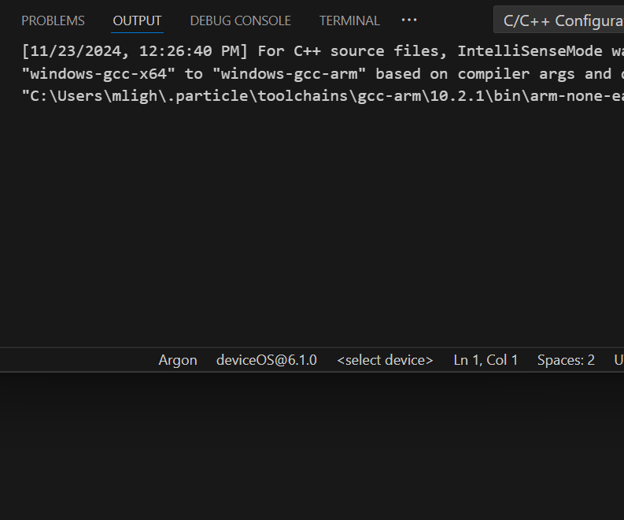
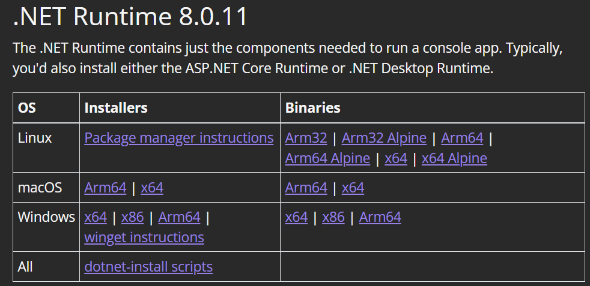
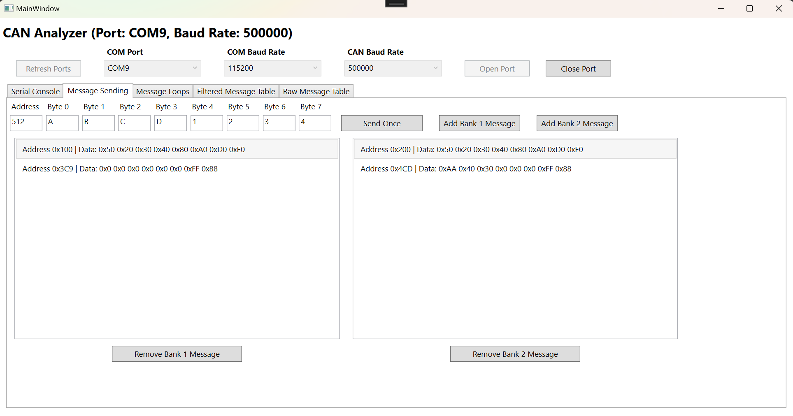

# CAN Analyzer
A Particle-based tool for analyzing CAN Bus frames and emulating CAN Bus sequences.


## Introduction
I initially developed this tool to assist in reverse-engineering the CAN Bus protocol for a [Volkswagen MK4 Golf instrument cluster](#chapter-1-mk4-vw-golf-gti-instrument-cluster) and a [2018 Camry instrument cluster](#chapter-2-2018-camry-instrument-cluster), but it's proven useful in many other projects, so I decided to polish it up and published it here. Details on how to use it are in the [User Manual](#user-manual-who-reads-those) section. I initially started off with a feature to send one message over CAN and receive any incoming messages and print them over serial. As I started working on more complicated projects, I added more features, such as printing only distinct addresses and looping over address/data values. These features helped in analyzing the Camry instrument cluster as well as the SolarPack Decentralized Low Voltage System. I've since migrated to using the [SolarPack Boards API](https://github.com/matthewpanizza/DecentralizedLV-Boards) for the platform-agnostic CAN Bus controller abstraction. To make the functionality more user-friendly, I've also made a GUI in Windows Presentation Format ([Model-View-ViewModel](https://learn.microsoft.com/en-us/dotnet/architecture/maui/mvvm) style C#). More details about the development of this tool and how I've used it are in the [Applications Section](#applications-put-theory-into-practice).

# User Manual (Who Reads Those?)
This section will detail how to get the hardware set up and how to use each of the commands. 

## Hardware Requirements
- Particle Photon or other Particle Microcontroller
- MCP2515 CAN Bus controller if not using the Photon
- CAN Bus Transceiver (I use the SN65HVD230)
- Breadboard + Wire Jumpers (or a PCB with the other components)

## Choosing a Microcontroller
I've set up the software to be able to handle multiple hardware configurations using the SolarPack Boards API, so most platforms should support this application. The Particle Photon is an older platform, but has an integrated CAN Bus controller so it requires less hardware to use. However, these are harder to come by nowadays since they are discontinued, so I've also made a revision that uses an external MCP2515 CAN Bus controller that is interfaced to using SPI. With the MCP2515, any Particle controller should be compatible. I've tested it using a Boron and Xenon, but other SPI-enabled platforms (like the Photon 2) should also work.

## Wiring up the Hardware
On the first CAN Analyzer I built, I used the Particle Xenon and soldered up a perfboard with headers for the microcontroller and the CAN transceiver. You could also set this up on a breadboard and use it that way. Below are the wiring diagrams of the two setups I've tested.

### CAN Bus Analyzer schematic using Particle Xenon (or other Featherwing microcontroller)


### CAN Bus Analyzer schematic using Particle Photon


The Chip Select (CS) and optional Interrupt (INT) pins can be done with any pin, but you will need to modify the macro in the CAN Analyzer software.

## Software Requirements
- [Visual Studio Code](https://code.visualstudio.com/)
- Serial Console (I prefer the one in the [Arduino IDE](https://www.arduino.cc/en/software))
- [Particle Workbench](https://marketplace.visualstudio.com/items?itemName=particle.particle-vscode-pack) extension for Visual Studio Code
- [Optional] [.NET 8 Runtime](https://dotnet.microsoft.com/en-us/download/dotnet/8.0) for running the User Interface. 
- [Optional] [Visual Studio](https://visualstudio.microsoft.com/vs/community/) for programming the User Interface

## Installing the Firmware
After installing Visual Studio Code and the Particle Workbench Extension, you're now ready to install the firmware on the microcontroller. First, open up the CANAnalyzer Particle project in Visual Studio Code by going to the Particle tab on the left toolbar and choosing Open Folder.


Choose the entire "CANAnalyzerParticle" folder from this repo (don't just open the .cpp or the src folder).


Once you've opened the folder, go to the Explorer tab on the left toolbar and expand the "src" folder. This folder will contain the source code for the program. Open up CANAnalyzerParticle.cpp.


With the source file opened, some new options should appear in the top left corner of VS Code. These are used to compile and flash the application to the device


Before we can flash the application though, please make sure the options are set up correctly for your microcontroller. To choose a platform, go to the bottom toolbar of VS Code, and there is a platform selection. Change this to whichever microcontroller you are using (Photon, Photon 2, Xenon, Argon, P2, etc.).



Next, connect your device using a USB cable to your computer. If you haven't registered the Particle device, its LED will be blinking blue. To set it up, follow Particle's [device setup process](https://setup.particle.io/). After registering with Particle, you will need to log in to Workbench by pressing Ctrl+Shift+P and doing Particle: Login. You'll need to log in for the flash tool to auto-detect your Particle device over USB, however there is a workaround. 


If your device has already had the Particle setup done on it, you can put it in DFU mode by pressing MODE and RESET, and then releasing RESET. Continue holding RESET until the LED is blinking yellow. From here you can flash the device. This is done by pressing the lightning bolt icon in the top right toolbar as previously shown. The output window will show the progress of the flash operation


With the device flashed, you should now be running the CAN Analyzer firmware. The LED should be solid green until you connect over Serial, and then it will turn solid cyan. If it shows flashing red, then validate your MCP2515 wiring.

## Using the Firmware

Once the firmware is uploaded, you can use a Serial console to communicate with the device and send or receive CAN Bus messages. I prefer the Serial console in the Arduino IDE, so I'll be using that for this tutorial. For the Arduino IDE, you'll need to indicate which COM port the tool is on.


With the port selected, you can click on Tools->Serial Monitor under the same toolbar. This will open up a separate window for the Serial monitor. In the bottom of this window is the Serial baud rate. The program defaults to 115200 baud, but can be changed using a command.


When first connecting to the tool, its LED will turn solid cyan and print out the help menu to the screen. This help menu has the list of available commands and the syntax to use each of the commands. Arguments can either be in Hexadecimal or Decimal format, indicated by ```x``` or ```d``` respectively. A ```-``` indicates no argument for that command. The current baud rate for CAN Bus and Serial are also printed in this menu. In this next section, I will show how to use each of the commands, along with some example situations.

## Command Dictionary

- [h - Help Command](#h---help-command)
- [b - Serial Baud Rate Command](#b---baud-command)
- [c - CAN Baud Rate Command](#c---can-bus-baud-rate-command)
- [s - Send Message Command](#s---send-message-command)
- [m - Add Message to Bank 1 Command](#m-and-n---message-bank-add-command)
- [n - Add Message to Bank 2 Command](#m-and-n---message-bank-add-command)
- [f - Flush Bank 1 Command](#f-and-g---flush-bank-command)
- [g - Flush Bank 2 Command](#f-and-g---flush-bank-command)
- [q - Query Messages Command](#q---query-messages-command)
- [a - Toggle "Print All" Mode Command](#a---toggle-print-all-mode-command)
- [p - Print Unique Command](#p---print-unique-command)
- [d - Print Delta Command](#d---print-delta-command)
- [l - Data Loop Command](#l---data-loop-command)
- [o - Address Loop Command](#o---address-loop-command)
- [k - Combo Loop Command](#k---combo-loop-command)
- [v - Print Version Command](#v---print-version-command)
- [i - App Mode Command](#i---app-mode-command)
- [j - Console Mode Command](#j---console-mode-command)

## Command Details

### ```h``` - Help Command
#### Arguments
None

#### Information
Prints a help menu for this command dictionary with some short descriptions and usage information. The arguments help section show which type of data the argument takes (either "x" for hexadecimal or "d" for decimal). Some arguments (like delay) take decimal instead of hex.

#### Returns
ASCII help menu.

### ```b``` - Baud Command
#### Arguments
- Argument 0 (Decimal) - New Serial baud rate. Must be greater than zero.

#### Information
Changes the baud rate the Serial port operates at. The default speed is 115200 baud. This value is configurable to many speeds, both slower and faster than 115200 baud. See the [Particle Docs](https://docs.particle.io/reference/device-os/firmware/#serial) to see the support baud rates for your microcontroller. If you're reading from a CAN Bus with a lot of data (i.e. you are printing a lot of data to the console), be sure you are using a fast baud rate or you will likely be missing messages!

#### Example

```b 115200``` - Sets the Serial baud rate to 115200 baud

#### Important Notes
The Serial baud rate will be stored in the device's EEPROM, so changing the baud rate will be persistent across reboots. If you change to 9600 baud, the next time the device boots, it will remain at 9600 baud. If you end up in a state where you don't know what the baud rate is, you can reset the EEPROM to the default settings (Serial baud of 115200 and CAN Baud of 500kbps) by clicking the MODE button three times quickly.

#### Returns
```Updating Serial baud rate to: {New Baud Rate}``` or ```Error! Baud rate was negative!``` if Argument 0 was negative.

### ```c``` - CAN Bus Baud Rate Command
#### Arguments
- Argument 0 (Decimal) - New CAN Bus baud rate. Setting this argument as 0 will return the current baud rate.

#### Information
Changes the baud rate the CAN Bus operates at. The default speed is 500kbps. Supported baud rates are 1000000, 500000, 250000, 200000, 125000, 100000, and 50000.

#### Example

```c 500000``` - Sets the CAN baud rate to 500kbps

#### Important Notes
The CAN baud rate will be stored in the device's EEPROM, so changing the baud rate will be persistent across reboots. If you change to 250kbps, the next time the device boots, it will remain at 250kbps. If you end up in a state where you don't know what the baud rate is, you can reset the EEPROM to the default settings (Serial baud of 115200 and CAN Baud of 500kbps) by clicking the MODE button three times quickly.

#### Returns
```Updating CAN baud rate to: {New Baud Rate}``` or ```CAN baud rate: {Current Baud Rate}``` if Argument 0 was 0.

### ```s``` - Send Message Command
#### Arguments
- Argument 0 (hex): CAN Bus Address
- Arguments 1-8 (hex): CAN Bus data bytes (bytes 0-7 respectively)

#### Information
Sends one message on the CAN Bus with the address specified by Argument 0 and the data bytes specified by Arguments 1-8. 

#### Example

```s 100 01 02 03 04 0a 0b 0c 0d``` - Sends one message on the CAN Bus with address 0x100 with data of [01 02 03 04 0a 0b 0c 0d].

#### Returns
```Send Packet: ID 0x[Argument 0] Data: [Arguments 1-8]```

### ```m``` and ```n``` - Message Bank Add Command
#### Arguments
- Argument 0 (hex): CAN Bus Address
- Arguments 1-8 (hex): CAN Bus data bytes (bytes 0-7 respectively)

#### Information
Adds a CAN Bus message to a Message Bank (```m``` for Message Bank 1, ```n``` for Message Bank 2). The message banks are a list of CAN Bus messages that are continuously emulated by the device. Each bank is configured to hold up to 10 messages, so the device can be set up to emulate up to 20 at one time. Sending the same CAN Bus address a second time will update the existing item in the menu. If you try to add more than 10 messages to a bank, then it will loop back around and replace the oldest message. Messages can be cleared from a bank by using the [Flush](#f-and-g---flush-bank-command) command for the particular bank. The two-bank system is used so you can flush only some of your messages but retain others. Messages with an address of 0 will not be sent.

#### Important Notes
This feature is useful for emulating CAN Bus systems where periodic transmission is needed, such as for a car instrument cluster. The instrument clusters need to hear from the other CAN Bus controllers at some frequency, or they will throw errors. Using the banks, you can emulate the necessary functions to disable these warnings! See the [Applications Section](#applications-put-theory-into-practice) for how I used this function.

#### Example
Some example message emulations would be: 
- Bank 1: ```m 3B7 0 0 0 0 0 0 0 0```
- Bank 1: ```m 3bb 40 0 0 0 0 0 0 0```
- Bank 1: ```m 412 0 4 c f 10 28 0 0```
- Bank 1: ```m 411 0 20 0 0 0 0 80 0```
- Bank 1: ```m 43a 1 1 1 1 0 0 0 0```
- Bank 2: ```n 1c4 0 0 0 0 0 0 d0 0```
- Bank 2: ```n 378 0 0 0 0 0 0 0 0```

Below example shows the printout after adding the messages above:

```
Bank 1 ID 0x3b7: 0 0 0 0 0 0 0 0
Bank 1 ID 0x3bb: 40 0 0 0 0 0 0 0
Bank 1 ID 0x412: 0 4 c f 10 28 0 0
Bank 1 ID 0x411: 0 20 0 0 0 0 80 0
Bank 1 ID 0x43a: 1 1 1 1 0 0 0 0
Bank 1 ID 0x0: 0 0 0 0 0 0 0 0
Bank 1 ID 0x0: 0 0 0 0 0 0 0 0
Bank 1 ID 0x0: 0 0 0 0 0 0 0 0
Bank 1 ID 0x0: 0 0 0 0 0 0 0 0
Bank 1 ID 0x0: 0 0 0 0 0 0 0 0
Bank 2 ID 0x1c4: 0 0 0 0 0 0 d0 0
Bank 2 ID 0x378: 0 0 0 0 0 0 0 0
Bank 2 ID 0x0: 0 0 0 0 0 0 0 0
Bank 2 ID 0x0: 0 0 0 0 0 0 0 0
Bank 2 ID 0x0: 0 0 0 0 0 0 0 0
Bank 2 ID 0x0: 0 0 0 0 0 0 0 0
Bank 2 ID 0x0: 0 0 0 0 0 0 0 0
Bank 2 ID 0x0: 0 0 0 0 0 0 0 0
Bank 2 ID 0x0: 0 0 0 0 0 0 0 0
Bank 2 ID 0x0: 0 0 0 0 0 0 0 0
DONE
```

#### Returns
Prints out a list of the CAN Messages currently being emulated by the CAN Analyzer, from both banks. 

### ```f``` and ```g``` - Flush Bank Command
#### Arguments
None

#### Information.
Clears any messages that are in the Message Banks. Sets the address to 0 for each of those messages so the messages are not emulated. ```f``` clears from Message Bank 1, and ```g``` clears from Message Bank 2.

#### Important Notes
See the [Message Bank Add Command](#m-and-n---message-bank-add-command) section to understand how the message banks work.

#### Returns
```Cleared All CAN Bus Emulation IDs```

### ```q``` - Query Messages Command
#### Arguments
None

#### Information
Queries the list of messages in the Message Banks and prints it out to the console.

#### Example
Printed list of all messages in Message Banks. After adding the example messages in [Message Bank Add Command](#m-and-n---message-bank-add-command) Example section, it would return:

```
Bank 1 ID 0x3b7: 0 0 0 0 0 0 0 0
Bank 1 ID 0x3bb: 40 0 0 0 0 0 0 0
Bank 1 ID 0x412: 0 4 c f 10 28 0 0
Bank 1 ID 0x411: 0 20 0 0 0 0 80 0
Bank 1 ID 0x43a: 1 1 1 1 0 0 0 0
Bank 1 ID 0x0: 0 0 0 0 0 0 0 0
Bank 1 ID 0x0: 0 0 0 0 0 0 0 0
Bank 1 ID 0x0: 0 0 0 0 0 0 0 0
Bank 1 ID 0x0: 0 0 0 0 0 0 0 0
Bank 1 ID 0x0: 0 0 0 0 0 0 0 0
Bank 2 ID 0x1c4: 0 0 0 0 0 0 d0 0
Bank 2 ID 0x378: 0 0 0 0 0 0 0 0
Bank 2 ID 0x0: 0 0 0 0 0 0 0 0
Bank 2 ID 0x0: 0 0 0 0 0 0 0 0
Bank 2 ID 0x0: 0 0 0 0 0 0 0 0
Bank 2 ID 0x0: 0 0 0 0 0 0 0 0
Bank 2 ID 0x0: 0 0 0 0 0 0 0 0
Bank 2 ID 0x0: 0 0 0 0 0 0 0 0
Bank 2 ID 0x0: 0 0 0 0 0 0 0 0
Bank 2 ID 0x0: 0 0 0 0 0 0 0 0
DONE
```

#### Returns
Printed table of messages in both message banks, followed by ```DONE```.

### ```a``` - Toggle "Print All" Mode Command
#### Arguments
None

#### Information
By default, the CAN Analyzer is set up to not print any received messages. Instead, the normal operation is to query the latest received messages (filtered by unique address) using the [Print Unique Command](#p---print-unique-command). However, you can set up the CAN Analyzer to print out all raw messages. The first number is the number of milliseconds since the CAN Analyzer has booted, so you can use this as a timestamp. Beware, this will generate a LOT of data if you have a busy CAN Bus! sending ```a``` will toggle between printing all or the default behavior of only printing using ```p``` or ```d```. See the Important Notes for the output format.

#### Important Notes
You can change the format of the output to be comma-separated instead of having spaces by changing to App Mode. See the [App Mode](#i---app-mode-command) and [Console Mode](#j---console-mode-command) commands for switching between modes. Default is Console Mode, which is separated by spaces for better console readability. App Mode is very handy for directly copying to a CSV file for easier processing using Excel or other applications. App mode also prints in decimal instead of hex for easier processing by the UI application.

#### Example
Below would be an example trace if this device were hooked up to the [Decentralized Low Voltage Dashboard Controller](https://github.com/matthewpanizza/DecentralizedLV-DashController) from the SolarPack CAN Bus system.

In Console Mode:
```
Enabling Print All
003978455 Received ID 0x00003b1 00 00 00 00 00 00 00 00
003978455 Received ID 0x00003bb 40 00 a0 00 00 00 00 00
003978456 Received ID 0x0000394 00 00 00 00 00 00 00 00
003978456 Received ID 0x000032c 00 00 00 00 00 00 00 00
003978457 Received ID 0x0000378 00 00 00 00 00 00 00 00
003978457 Received ID 0x0000412 00 00 00 00 00 00 00 00
003978458 Received ID 0x0000411 00 00 00 00 00 00 00 00
003978458 Received ID 0x000043a 01 01 01 01 00 00 00 00
003978459 Received ID 0x0000633 81 00 00 00 00 00 50 0d
003978459 Received ID 0x0000620 10 00 00 00 b0 40 08 00
003978460 Received ID 0x00001ea 00 00 00 00 00 00 05 00
003978460 Received ID 0x00003bc 00 00 00 00 00 00 00 00
003978461 Received ID 0x0000400 00 00 00 00 00 00 00 00
003978461 Received ID 0x0000099 ff 00 00 ff 00 00 00 03
003978462 Received ID 0x00003b7 00 00 00 00 00 00 00 00
003978462 Received ID 0x00003b1 00 00 00 00 00 00 00 00
003978463 Received ID 0x00003bb 40 00 a0 00 00 00 00 00
003978463 Received ID 0x0000394 00 00 00 00 00 00 00 00
003978464 Received ID 0x000032c 00 00 00 00 00 00 00 00
003978464 Received ID 0x0000378 00 00 00 00 00 00 00 00
003978465 Received ID 0x0000412 00 00 00 00 00 00 00 00
003978465 Received ID 0x0000411 00 00 00 00 00 00 00 00
003978466 Received ID 0x000043a 01 01 01 01 00 00 00 00
003978466 Received ID 0x0000633 81 00 00 00 00 00 50 0d
003978467 Received ID 0x0000620 10 00 00 00 b0 40 08 00
003978467 Received ID 0x00001ea 00 00 00 00 00 00 05 00
003978468 Received ID 0x00003bc 00 00 00 00 00 00 00 00
003978468 Received ID 0x0000400 00 00 00 00 00 00 00 00
003978469 Received ID 0x0000099 ff 00 00 ff 00 00 00 03
003978469 Received ID 0x00003b7 00 00 00 00 00 00 00 00
003978470 Received ID 0x00003b1 00 00 00 00 00 00 00 00
003978470 Received ID 0x00003bb 40 00 a0 00 00 00 00 00
003978471 Received ID 0x0000394 00 00 00 00 00 00 00 00
003978471 Received ID 0x000032c 00 00 00 00 00 00 00 00
003978472 Received ID 0x0000378 00 00 00 00 00 00 00 00
003978472 Received ID 0x0000412 00 00 00 00 00 00 00 00
003978472 Received ID 0x0000411 00 00 00 00 00 00 00 00
```

In App Mode:
```
EPA
A,4306425,153,255,0,0,255,0,0,0,3
A,4306425,951,0,0,0,0,0,0,0,0
A,4306426,945,0,0,0,0,0,0,0,0
A,4306426,955,64,0,160,0,0,0,0,0
A,4306427,916,0,0,0,0,0,0,0,0
A,4306427,812,0,0,0,0,0,0,0,0
A,4306428,888,0,0,0,0,0,0,0,0
A,4306428,1042,0,0,0,0,0,0,0,0
A,4306429,1041,0,0,0,0,0,0,0,0
A,4306429,1082,1,1,1,1,0,0,0,0
A,4306430,1587,129,0,0,0,0,0,80,13
A,4306430,1568,16,0,0,0,176,64,8,0
A,4306431,490,0,0,0,0,0,0,5,0
A,4306431,956,0,0,0,0,0,0,0,0
A,4306432,1024,0,0,0,0,0,0,0,0
A,4306432,1570,18,0,232,0,0,0,0,0
A,4306432,153,255,0,0,255,0,0,0,3
A,4306433,951,0,0,0,0,0,0,0,0
A,4306433,945,0,0,0,0,0,0,0,0
A,4306434,955,64,0,160,0,0,0,0,0
A,4306434,916,0,0,0,0,0,0,0,0
A,4306435,812,0,0,0,0,0,0,0,0
A,4306435,888,0,0,0,0,0,0,0,0
A,4306436,1042,0,0,0,0,0,0,0,0
A,4306436,1041,0,0,0,0,0,0,0,0
A,4306437,1082,1,1,1,1,0,0,0,0
A,4306437,1587,129,0,0,0,0,0,80,13
A,4306438,1568,16,0,0,0,176,64,8,0
A,4306438,490,0,0,0,0,0,0,5,0
A,4306439,956,0,0,0,0,0,0,0,0
A,4306439,1024,0,0,0,0,0,0,0,0
A,4306439,153,255,0,0,255,0,0,0,3
```

#### Returns
```Enabling Print All``` or ```Disabling Print All``` in Console Mode

```EPA``` or ```DPA``` in App Mode

### ```p``` - Print Unique Command
#### Arguments
None

#### Information
Prints out a table of the most recent CAN messages received by the CAN Analyzer. Messages are filtered based on address, so the latest data received on one address is shown. If you need to see all changes in data, use the [Print All Command](#a---toggle-print-all-mode-command). The table also contains a column for if the message has been received since the last time you sent the ```p``` command. If there is an asterisk, then that means the message has been received again since you last sent ```p```, otherwise, the data is stale.


#### Example
Below would be an example trace if this device were hooked up to the [Decentralized Low Voltage Dashboard Controller](https://github.com/matthewpanizza/DecentralizedLV-DashController) from the SolarPack CAN Bus system.
```
============ DISCOVERED CAN IDS ==============
=     ID     x0 x1 x2 x3 x4 x5 x6 x7 Updated =
= 0x00000099 ff 00 00 ff 00 00 00 03    *    =
= 0x000001ea 00 00 00 00 00 00 05 00    *    =
= 0x0000032c 00 00 00 00 00 00 00 00    *    =
= 0x00000378 00 00 00 00 00 00 00 00    *    =
= 0x00000394 00 00 00 00 00 00 00 00         =
= 0x000003b1 00 00 00 00 00 00 00 00         =
= 0x000003b7 00 00 00 00 00 00 00 00         =
= 0x000003bb 40 00 a0 00 00 00 00 00         =
= 0x000003bc 00 00 00 00 00 00 00 00         =
= 0x00000400 00 00 00 00 00 00 00 00         =
= 0x00000411 00 00 00 00 00 00 00 00         =
= 0x00000412 00 00 00 00 00 00 00 00         =
= 0x0000043a 01 01 01 01 00 00 00 00         =
= 0x00000620 10 00 00 00 b0 40 08 00         =
= 0x00000622 12 00 e8 00 00 00 00 00         =
= 0x00000633 81 00 00 00 00 00 50 0d         =
==============================================
```

#### Returns
Printed table of messages received by the CAN Analyzer.

### ```d``` - Print Delta Command
#### Arguments
None

#### Information
Like the [Print Unique Command](#p---print-unique-command), but prints out a table of only the CAN messages received whose data has changed since the last ```d``` command was sent. Messages are filtered based on address, so the latest data received on one address is shown.

#### Example
Below would be an example trace if this device were hooked up to the [Decentralized Low Voltage Dashboard Controller](https://github.com/matthewpanizza/DecentralizedLV-DashController) from the SolarPack CAN Bus system.

Send the ```d``` command once:
```
============ DISCOVERED CAN IDS ==============
=     ID     x0 x1 x2 x3 x4 x5 x6 x7 Updated =
= 0x00000099 ff 00 00 ff 00 00 00 03         =
= 0x000001ea 00 00 00 00 00 00 05 00         =
= 0x0000032c 00 00 00 00 00 00 00 00         =
= 0x00000378 00 00 00 00 00 00 00 00         =
= 0x00000394 00 00 00 00 00 00 00 00         =
= 0x000003b1 00 00 00 00 00 00 00 00         =
= 0x000003b7 00 00 00 00 00 00 00 00         =
= 0x000003bb 40 00 a0 00 00 00 00 00         =
= 0x000003bc 00 00 00 00 00 00 00 00         =
= 0x00000400 00 00 00 00 00 00 00 00         =
= 0x00000411 00 00 00 00 00 00 00 00         =
= 0x00000412 00 00 00 00 00 00 00 00         =
= 0x0000043a 01 01 01 01 00 00 00 00         =
= 0x00000620 10 00 00 00 b0 40 08 00         =
= 0x00000622 12 00 e8 00 00 00 00 00         =
= 0x00000633 81 00 00 00 00 00 50 0d         =
==============================================
```
Say the Analyzer received ID ```0x99``` with data ```bb cc dd ee ff 00 00 03``` as well as ID ```0x1ea``` with data ```00 00 00 00 00 00 05 00```

Send the ```d``` command again:
```
============ DISCOVERED CAN IDS ==============
=     ID     x0 x1 x2 x3 x4 x5 x6 x7 Updated =
= 0x00000099 bb cc dd ee ff 00 00 03    *    =
==============================================
```
Only ```0x99``` is shown, since the other ID's *data* has not changed (even if a message has been received on the same *address*).

#### Returns
Printed table of messages whose data has changed since the last time this command was sent.

### ```l``` - Data Loop Command
#### Arguments
- Argument 0 (hex): CAN Address to perform the data loop on
- Argument 1 (hex): Bit mask for which data bytes to perform the loop on (0x00-0xff)
- Argument 2 (hex): Delay between sending of CAN Messages (in milliseconds)

#### Information
Loops over all possible data values for each byte (```0x00``` - ```0xFF```). A feature useful for reverse-engineering instrument clusters as you can test all values of a byte without having to manually type it. After sending the command, the tool will loop from 0x00 to 0xFF with a delay specified by Argument 2. Sending any Serial character will break the loop. Argument 1 is a mask that specifies which bytes to transmit on. A mask of ```0x0F``` is binary ```00001111```, which means that bytes 0 through 3 will have the non-zero loop data, while bytes 4 through 7 will have zero for their data.

#### Example
```l 100 f 64``` is a loop on address ```0x100``` with a mask of ```0x0F``` and a delay of ```100ms```. A total of 256 messages are sent.

```
Starting data loop on 0x100 with mask 0xf and delay 100ms
Sending ID 0x0000100 00 00 00 00 00 00 00 00
Sending ID 0x0000100 01 01 01 01 00 00 00 00
Sending ID 0x0000100 02 02 02 02 00 00 00 00
Sending ID 0x0000100 03 03 03 03 00 00 00 00
Sending ID 0x0000100 04 04 04 04 00 00 00 00
Sending ID 0x0000100 05 05 05 05 00 00 00 00
Sending ID 0x0000100 06 06 06 06 00 00 00 00
Sending ID 0x0000100 07 07 07 07 00 00 00 00
Sending ID 0x0000100 08 08 08 08 00 00 00 00
Sending ID 0x0000100 09 09 09 09 00 00 00 00
Sending ID 0x0000100 0a 0a 0a 0a 00 00 00 00
Sending ID 0x0000100 0b 0b 0b 0b 00 00 00 00
Sending ID 0x0000100 0c 0c 0c 0c 00 00 00 00
.
.
.
Sending ID 0x0000100 fe fe fe fe 00 00 00 00
Sending ID 0x0000100 fd fd fd fd 00 00 00 00
Sending ID 0x0000100 ff ff ff ff 00 00 00 00
```

#### Returns
```Starting data loop on [Argument 0] with mask [Argument 1] and delay [Argument 2]ms```

### ```o``` - Address Loop Command
#### Arguments
- Argument 0 (hex): Starting CAN Address
- Argument 1 (hex): Ending CAN Address
- Argument 2 (hex): Data to send on all 8 data bytes
- Argument 3 (hex): Delay between sending of CAN Messages (in milliseconds)
- Argument 4 (hex, optional): Step size. Default is 1 message.

#### Information
Sends a CAN Bus message on all addresses between Argument 0 and Argument 1. The data of the messages is specified by Argument 2. Argument 3  is the number of milliseconds between changes of address. The step size specifies how many messages are sent at one time so you can more quickly step through the values. Sending any Serial character will break the loop.

#### Important Notes
Since some CAN Bus peripherals require receiving messages frequently, the delay is set up to have the messages sent every 10ms, even if the delay is longer. The delay specified by Argument 3 is sliced down into 10ms intervals where the same address is sent. In the Example below, with a delay of 100ms (0x64), each of the messages will be sent 10 times.

#### Example
```o 100 200 ab 64 1``` is a loop from address ```0x100``` to ```0x200``` with a data value of ```0xab``` and a delay of ```100ms```. Each message in this example will be sent 10 times.

```
Starting address loop from 0x100 to 0x200 and delay 100ms
Sending ID 0x0000100 ab ab ab ab ab ab ab ab
Sending ID 0x0000101 ab ab ab ab ab ab ab ab
Sending ID 0x0000102 ab ab ab ab ab ab ab ab
Sending ID 0x0000103 ab ab ab ab ab ab ab ab
Sending ID 0x0000104 ab ab ab ab ab ab ab ab
Sending ID 0x0000105 ab ab ab ab ab ab ab ab
Sending ID 0x0000106 ab ab ab ab ab ab ab ab
Sending ID 0x0000107 ab ab ab ab ab ab ab ab
Sending ID 0x0000108 ab ab ab ab ab ab ab ab
Sending ID 0x0000109 ab ab ab ab ab ab ab ab
Sending ID 0x000010a ab ab ab ab ab ab ab ab
Sending ID 0x000010b ab ab ab ab ab ab ab ab
Sending ID 0x000010c ab ab ab ab ab ab ab ab
Sending ID 0x000010d ab ab ab ab ab ab ab ab
Sending ID 0x000010e ab ab ab ab ab ab ab ab
Sending ID 0x000010f ab ab ab ab ab ab ab ab
Sending ID 0x0000110 ab ab ab ab ab ab ab ab
Sending ID 0x0000111 ab ab ab ab ab ab ab ab
.
.
.
Sending ID 0x00001fe ab ab ab ab ab ab ab ab
Sending ID 0x00001ff ab ab ab ab ab ab ab ab
Sending ID 0x0000200 ab ab ab ab ab ab ab ab
```

What the receiver would see
```
ms         addr            data
0       0x0000100 ab ab ab ab ab ab ab ab
10      0x0000100 ab ab ab ab ab ab ab ab
20      0x0000100 ab ab ab ab ab ab ab ab
30      0x0000100 ab ab ab ab ab ab ab ab
40      0x0000100 ab ab ab ab ab ab ab ab
50      0x0000100 ab ab ab ab ab ab ab ab
60      0x0000100 ab ab ab ab ab ab ab ab
70      0x0000100 ab ab ab ab ab ab ab ab
80      0x0000100 ab ab ab ab ab ab ab ab
90      0x0000100 ab ab ab ab ab ab ab ab
100     0x0000101 ab ab ab ab ab ab ab ab
110     0x0000101 ab ab ab ab ab ab ab ab
120     0x0000101 ab ab ab ab ab ab ab ab
130     0x0000101 ab ab ab ab ab ab ab ab
.
.
.

25660   0x0000200 ab ab ab ab ab ab ab ab
25670   0x0000200 ab ab ab ab ab ab ab ab
25680   0x0000200 ab ab ab ab ab ab ab ab
25690   0x0000200 ab ab ab ab ab ab ab ab
```

#### Returns
```Starting address loop from 0x[Argument 0] to 0x[Argument 1] and delay [Argument 3]ms```

### ```k``` - Combo Loop Command
#### Arguments
- Argument 0 (hex): Starting CAN Address
- Argument 1 (hex): Ending CAN Address
- Argument 2 (hex): Delay between sending of CAN Messages (in milliseconds)
- Argument 3 (hex, optional): Step size. Default is 1 message.

#### Information

A more-complicated brute-force loop used to send all possible combinations of data bytes on each address. Sends a CAN Bus message on all addresses between Argument 0 and Argument 1. The data of the messages is looped from 0-0xFF on all data bytes (so 255 values are sent per address). Argument 3  is the number of milliseconds between changes of data. The step size specifies how many messages are sent at one time so you can more quickly step through the addresses. Sending any Serial character will break the loop.

#### Important Notes
Since some CAN Bus peripherals require receiving messages frequently, the delay is set up to have the messages sent every 10ms, even if the delay is longer. The delay specified by Argument 3 is sliced down into 10ms intervals where the same address is sent. In the Example below, with a delay of 100ms (0x64), each of the messages will be sent 10 times.

#### Example
```k 100 105 32 1``` is a loop from address ```0x100``` to ```0x105``` with a delay of ```50ms``` and a step size of 1 address per step.
```
Starting combo loop from 0x100 to 0x105 and delay 50ms
Sending ID 0x0000100 00 00 00 00 00 00 00 00
Sending ID 0x0000100 01 01 01 01 01 01 01 01
Sending ID 0x0000100 02 02 02 02 02 02 02 02
Sending ID 0x0000100 03 03 03 03 03 03 03 03
Sending ID 0x0000100 04 04 04 04 04 04 04 04
Sending ID 0x0000100 05 05 05 05 05 05 05 05
Sending ID 0x0000100 06 06 06 06 06 06 06 06
Sending ID 0x0000100 07 07 07 07 07 07 07 07
Sending ID 0x0000100 08 08 08 08 08 08 08 08
.
.
.
Sending ID 0x0000100 fd fd fd fd fd fd fd fd
Sending ID 0x0000100 fe fe fe fe fe fe fe fe
Sending ID 0x0000100 ff ff ff ff ff ff ff ff
Sending ID 0x0000101 00 00 00 00 00 00 00 00
Sending ID 0x0000101 01 01 01 01 01 01 01 01
Sending ID 0x0000101 02 02 02 02 02 02 02 02
.
.
.
Sending ID 0x0000105 fd fd fd fd fd fd fd fd
Sending ID 0x0000105 fe fe fe fe fe fe fe fe
Sending ID 0x0000105 ff ff ff ff ff ff ff ff
```

Changing the step size to ```3``` would send ```0x100```, ```0x101```, and ```0x102``` at the same time. The overall loop would take 1/3 the time. That command would be ```k 100 105 32 3``` and would produce the following:

```
Starting combo loop from 0x100 to 0x105 and delay 50ms
Sending ID 0x0000100 00 00 00 00 00 00 00 00
Sending ID 0x0000101 00 00 00 00 00 00 00 00
Sending ID 0x0000102 00 00 00 00 00 00 00 00
Sending ID 0x0000100 01 01 01 01 01 01 01 01
Sending ID 0x0000101 01 01 01 01 01 01 01 01
Sending ID 0x0000102 01 01 01 01 01 01 01 01
Sending ID 0x0000100 02 02 02 02 02 02 02 02
Sending ID 0x0000101 02 02 02 02 02 02 02 02
Sending ID 0x0000102 02 02 02 02 02 02 02 02
Sending ID 0x0000100 03 03 03 03 03 03 03 03
Sending ID 0x0000101 03 03 03 03 03 03 03 03
Sending ID 0x0000102 03 03 03 03 03 03 03 03
Sending ID 0x0000100 04 04 04 04 04 04 04 04
Sending ID 0x0000101 04 04 04 04 04 04 04 04
Sending ID 0x0000102 04 04 04 04 04 04 04 04
.
.
.
Sending ID 0x0000103 fd fd fd fd fd fd fd fd
Sending ID 0x0000104 fd fd fd fd fd fd fd fd
Sending ID 0x0000105 fd fd fd fd fd fd fd fd
Sending ID 0x0000103 fe fe fe fe fe fe fe fe
Sending ID 0x0000104 fe fe fe fe fe fe fe fe
Sending ID 0x0000105 fe fe fe fe fe fe fe fe
Sending ID 0x0000103 ff ff ff ff ff ff ff ff
Sending ID 0x0000104 ff ff ff ff ff ff ff ff
Sending ID 0x0000105 ff ff ff ff ff ff ff ff
```

#### Returns
```Starting combo loop from 0x[Argument 0] to 0x[Argument 1] and delay [Argument 3]ms```

### ```v``` - Print Version Command
#### Arguments
None

#### Information
Prints out the firmware version of the CAN Analyzer as coded in the CANAnalyzerParticle.cpp file.

#### Returns
String containing the version number (i.e ```1.0```).

### ```i``` - App Mode Command
#### Arguments
None

#### Information
Switches the Analyzer to App Mode, which changes the format of the messages printed over Serial to be more machine friendly. The response codes are shortened, and all responses are comma-delimited to make parsing by an app easier.

#### Returns
```APPMODE```


### ```j``` - Console Mode Command
#### Arguments
None

#### Information
Switches the Analyzer to Console Mode (the default mode), which changes the format of the messages printed over Serial to be more user-friendly. Numbers are separated with spaces to be more visually readable.

#### Returns
```Standard Print Mode```

## [Optional] Using the UI
To attempt to make the tool more user-friendly, I've made a user interface in C# that will allow using commands with buttons and text boxes. Right now, this tool is experimental and may not work as expected. The message reception tables have performance issues when operating with a busy CAN Bus.

To launch the app, you'll need to have the [.NET 8 Runtime](https://dotnet.microsoft.com/en-us/download/dotnet/8.0) installed. 



The binaries are in ```CANAnalyzerWPF\bin\Debug\net8.0-windows```, and you'll want to run ```CANAnalyzerWPF.exe```. If you want to debug/develop more with this app, install [Visual Studio Community](https://visualstudio.microsoft.com/vs/community/) and the C# development tools.

The UI itself has tabs for each of the commands, and the first page is a basic Serial console. After connecting the CAN Analyzer, you'll want to choose the correct COM port, Serial baud rate, and CAN baud rate. Then click "Open" to open the COM port.


After opening the port, you can enter in Serial commands and click "Send Data" as you would with the Arduino serial console. The title will also show information about the COM port and CAN Bus speed


The next set of pages are specific to commands for the Analyzer. The Message Sending tab is an interface for the ```s```, ```m```, ```n```, ```f```, and ```g``` commands for managing the Message Banks. The data you wish to send is entered in the text boxes, and you can send that message one time (the ```s``` command) or add it to one of the message banks (the ```m``` or ```n``` commands). There are also buttons to clear a message from the bank. Unlike with the Serial console version, the UI holds the list of messages, so you can remove a particular message from the banks. Under the hood, the UI will clear the message banks, and then re-send the ones that were not deleted.



The Message Loops tab is an interface for the ```l``` and ```o``` commands. For the data loop, the check boxes indicate which bytes should have the data looped on. The underlying software generates the mask for the command's argument. The text boxes indicate the messages and data transmitted by the Analyzer.


The last two tabs are for receiving messages. IMPORTANT: you need to go to the Serial Console and enable "Receive All" mode by sending the ```a``` command. The tables in each tab parse out data from the raw received messages. The Filtered Message Table is like the ```p``` command, except that it continually updates as messages are received. There is a timestamp for the last time that a message with a given address is received.


There's also a button to save the raw traces to a CSV, which may come in handy for analyzing received messages, as you can import into Excel and sort the IDs and/or timestamps.

# Applications (Put Theory Into Practice!)
## Chapter 1: MK4 VW Golf GTI Instrument Cluster
This tool was originally developed when I was attempting to reverse engineer an instrument cluster from the MK4 Volkswagen Golf GTI for the [SolarPack Project](https://www.solarpacknc.com/). At the time, we had just returned from the first year of taking the EV-converted Golf to the competition (Summer 2021), and I wanted to improve the driver instrumentation system. We had removed all of the original electronics in the vehicle but still had the components in a bin. Fortunately, the instrument cluster and it's connector harness were in one piece, so I figured it would be worth a shot to use as a display.

### An Old Friend: The Junkpile Special

Upon first powering the instrument cluster, all of the warning lights lit up, and the warning buzzer started screaming. It seems the cluster requires hearing from all modules in the car (ECU, Airbag, ABS, etc) over CAN or it will post errors. I did some Googling on the instrument cluster and came across this [MK4 GTI CAN Bus](https://vehicle-reverse-engineering.fandom.com/wiki/Volkswagen#VW_Golf_GTI_MK5) reference page.

### Bare-bones and Breadboards

To emulate some of the messages from the reference page, I needed hardware that could do CAN Bus communication, so I started with a spare Particle Argon connected to a MCP2515 on a breadboard. With the MCP_CAN_RK library installed, I wrote a basic script that would send one message at a time, with my now-favorite abstraction function:

 ```CANSend(uint16_t Can_addr, byte data0, byte data1, byte data2, byte data3, byte data4, byte data5, byte data6, byte data7)```

This function would send one message over CAN using the MCP2515, with the address and data specified by the arguments. With this, I could also do ```for``` and ```while``` loops to change which values were sent. 

### First Steps

I tried sending the IDs from the sheet, and was able to get one of them to work. The following function call was able to get the RPM gauge working on the cluster:

```CANSend(0x280, 0x49, 0x0E, RPM&255, RPM>>8, 0x0E, 0x00, 0x1B, 0x0E)```


The RPM value in the function call is divided by four internally, so there's some math in the function call that converts to displayed RPM from a raw integer variable.

- ```CANSend(0x050, 0x00, 0x80, 0x04, 0x00, 0x00, 0x00, 0x00, 0x00)```: Spoof for Airbag
- ```CANSend(0x1A0, 0x18, errcode, 0x00, 0x00, 0xfe, 0xfe, 0x00, 0xff)```: Spoof for ABS
- ```CanSend(0x480,0x00,errVal,0xFF,0xFF,0xFF,0xFF,0xFF,0xFF)```: Spoof for ECU

I tested different values for ```errcode``` and found that ```0x88``` turns on the Check Engine warning light, and ```0x82``` turns off the Check Engine light. Profit. I integrated these spoofs into the [Decentralized Low Voltage Sense Board](https://github.com/matthewpanizza/DecentralizedLV-Sense) software which mapped the electric motor RPM to the dial, and the Battery Management System fault state to the Check Engine light. The other controls were all analog, such as the 
vehicle speed sensor in the transmission, so those did not require CAN Bus spoofing. Below is the code I used to test the spoof:

```cpp
#include <mcp_can.h>
#include <SPI.h>

SYSTEM_MODE(MANUAL);
SerialLogHandler logHandler;

#define CAN0_INT A1                              // Set INT to pin A1
MCP_CAN CAN0(A2);                               // Set CS to pin A2
uint8_t errVal;


void setup()
{
  Serial.begin(115200);

  // Initialize MCP2515 running at 16MHz with a baudrate of 500kb/s and the masks and filters disabled.
  if(CAN0.begin(MCP_ANY, CAN_500KBPS, MCP_8MHZ) == CAN_OK) Serial.println("MCP2515 Initialized Successfully!");
  else Serial.println("Error Initializing MCP2515...");

  errVal = 0x01;

  CAN0.setMode(MCP_NORMAL);   // Change to normal mode to allow messages to be transmitted
}

void loop(){

    //Bytes 2 and 3 are the RPM value divided by four (0x1010/4 = 1028 RPM)
    CanSend(0x280, 0x49, 0x0E, 0x10, 0x10, 0x0E, 0x00, 0x1B, 0x0E);
    delay(10);
    
    //ABS
    //Byte 0 - 0x18s
    //Byte 1 - ABS indicator See https://vehicle-reverse-engineering.fandom.com/wiki/Volkswagen#VW_Golf_GTI_MK5
    // "!" on website is the "BRAKE" label, "ABS" is "ABS", "ESP" is the "restart triangle" on dash
    CanSend(0x1A0, 0x18, 0x00, 0x00, 0x00, 0xfe, 0xfe, 0x00, 0xff);
    delay(10);
  
    //Airbag
    CanSend(0x050, 0x00, 0x80, 0x04, 0x00, 0x00, 0x00, 0x00, 0x00);
    delay(10);

    //Byte 1 - Bit0: ABS Bit1: ESP Bit2: EPC + BRAKE + BEEP Bit3: Check engine
    CanSend(0x480,0x00,errVal,0xFF,0xFF,0xFF,0xFF,0xFF,0xFF);
    delay(10);
}

void CanSend(uint16_t Can_addr, byte data0, byte data1, byte data2, byte data3, byte data4, byte data5, byte data6, byte data7){
    byte data[8] = {data0, data1, data2, data3, data4, data5, data6, data7};
    byte sndStat = CAN0.sendMsgBuf(Can_addr, 0, 8, data);
}
```

The new MP2515-based CAN Bus controller proved to be useful for debugging the instrument cluster and the Decentralized Low Voltage System, so I took the breadboard setup and soldered the components to a perfboard so it was more permanent. That version is pictured at the start of this README. We took the Golf back to the competition with the VW cluster and found it to be a nice upgrade as it turned on instantaneously and interfaced the information we needed. 

## Chapter 2: 2018 Camry Instrument Cluster
### A New Beginning: The Instrument Clusters Strike Back

After that summer, we were looking to build a new custom-chassis car and I wanted to give the instrumentation system an upgrade. On eBay, I found an instrument cluster from a 2018 Toyota Camry for $60 and figured this would be a good candidate considering it's fairly modern layout and the fact that I own a car of the same model-year.

Upon powering the new cluster, it lit up with a whole host of warnings and errors - far more than the Golf cluster could ever have.


Unlike the MK4 cluster there was *no documentation* on the CAN Bus system in the Camry, as it was only four years old at the time of experimentation. One option would be to read all of the CAN Bus IDs from my Camry and emulate them to this instrument cluster to try and clear errors, but I didn't want to go taking apart my car if it could be done another way. The only other option would be to brute-force all possible  However, with the complexity of the newer instrument cluster, I needed to improve the software capabilities of the CAN Bus tool (which was only hard-wired to send the MK4 IDs) to be more dynamic.

### Getting an Upgrade
I started out adding Serial functionality to read commands from a console. I first added the ```s``` and ```p``` commands so I could send single messages and see the messages received on the bus. The now-functional Decentralized Low Voltage System was a great test bench for the new mechanism. I emulated the Sense Board and turned on the lights and pumps in the car by changing the data. The Decentralized Sense board transmitted data with the following format, so I needed my data values to follow the same encoding:

```
// byte 0: Right Turn PWM 0-255
// byte 1: Left Turn PWM 0-255
// byte 2: Brake PWM 0-255
// byte 3: Reverse PWM 0-255
// byte 4: b0: Headlight, b1: High-Beam, b2: Trunk-Release, b3: Driver-Fan, b4: Power-Steer-Relay, b5: reverse-sense-camera
// byte 5: Power Mode: 0-Acc, 1-Ign, 2-LPAcc, 3-LPIgn
// byte 6: Pump Mode: 0-Off, 1-LPRun, 2-Run, 4-Boost
// byte 7: b0: Radiator Fan, b1: Radiator pump, b2: Brake Boost, b3: Battery Fan, b4: MPPT-On
```

Sending ```s 100 ff ff 0 0 9 0 0 0``` turned on the left and right turn signals, the headlights, and the driver fan. I could send the ```s``` command again with different data and see the state of the lights change. ```s 100 0 0 ff 0 2 0 0 0``` turned off the turn signals and headlights, turned on the brake lights, and turned on the high beams.

The ```p``` command also was printing out data received from the other boards in the car such as the Systems Architecture telemetry computer and Rear-Left [Low-Power Driver board](https://github.com/matthewpanizza/DecentralizedLV-LPDRV) (which transmitted booleans to indicate the fault state of the Battery Management System).

The ```p``` and ```s``` commands were working as expected, but I needed a way to periodically emulate messages. Without periodic message reception, instrument clusters (like the Golf's) would throw errors. The solution I landed on was the Message Bank system. The [circular-buffer style](https://en.wikipedia.org/wiki/Circular_buffer) seemed like a good approach for replacing messages when there are too many. Originally, I only had this set up with one bank and one flush command. I tested the new ```m``` and ```f``` commands using the old Golf instrument cluster by adding in the spoofs that were in the Sense Board software, and the errors were cleared as expected.

### Advanced Loops
While the message banks were great for continuous emulation, it would be a very slow process to brute-force send all possible CAN Bus IDs. I was short on time when doing the initial reverse-engineering, so I coded the equivalent of the [Combo Loop Command](#k---combo-loop-command), which tried all possible 11-bit CAN Bus addresses (```0x00```-```0x7FF```) and looped the data from ```0x00```-```0xFF``` on all bytes. I used a step size of 8 (i.e. 8 addresses are sent at one time) to speed up how quickly the brute-force would take.

### The Great Timelapse
The hardcoded loop was now set up, and I was ready to do the brute-force approach to find the CAN IDs. Even with the automated system and a large step size, it still ended up taking about 10 hours. I set up my phone to record the instrument cluster and the Serial console (which had the data value and address printed) so the videos could easily be scrubbed through later. Below is a GIF of the setup when it captured the Power Steering ID. The steering wheel indicator in the bottom-left turned off, then flashed when the different values were sent.


With the 10 hours of footage obtained, I was able to quickly scrub through and find frames where one of the lights flickered. I could then read the range of 8 IDs being sent at the time along with the data. Then, with the Message Bank, I tested each of the 8 to narrow down which ID was the one controlling the warning-of-interest. In that GIF, it was sending CAN addresses ```0x391``` through ```0x398```. I was able to narrow it down to address ```0x392```. Setting all of the data bytes to 0x00 cleared the warning for power steering.

### Polishing Things Up
I had figured out a range of where CAN Bus addresses changed an element on the UI, but I wanted to be able to test values more efficiently, so I made the [Address Loop Command](#o---address-loop-command) and [Data Loop Command](#l---data-loop-command). With the Address Loop, I could punch in ```o 391 398 00 7D0 1``` to test each address with 2 seconds (0x7D0 milliseconds) between them. Then once I found the address, I could use the data loop to test which values generated/cleared errors. ```l 392 1 FA``` would tell me what effect byte 0 has on the cluster, and ```l 392 2 FA``` would tell me what effect byte 1 has.

### I Spy (With My 32-Bit Eye)
With some more trust in the CAN Analyzer, I felt safe connecting it up to my Camry Hybrid to look for any CAN Bus IDs that I may have missed. I opened up the dashboard in my car to get to the connector on the back of the cluster and tapped onto the CAN Bus. I then used the [Print Unique Command](#p---print-unique-command) to see a consolidated list of all addresses being transmitted. There was a LOT of data being sent in the CAN Bus that would be excessive to show here, but I have the data saved in the CarSampledData.txt file in this repo.

### CAN Bus Codes
Below is a table of CAN Bus codes I was able to figure out using the timelapse and the Camry trace. There is a spoof set up in the new [Decentralized Low Voltage Dash Controller](https://github.com/matthewpanizza/DecentralizedLV-DashController) (in src/DecentralizedLV-DashController.ino) with the [Boards API](https://github.com/matthewpanizza/DecentralizedLV-Boards) to interface the electrical system information to the instrument cluster dials, indicators, and LCD prompts.

#### Error Clearing

| Item                              | CAN ID | Data Bytes              | Variable Data                                                        |
|-----------------------------------|--------|-------------------------|----------------------------------------------------------------------|
| Brake, ABS errors                 | 0x3B7  | X 0 0 0 0 0 0 0         | X = 0x40 - BRAKE Text On                                             | 
| Seatbelt Indicator                | 0x3B1  | 0 0 0 X 0 0 0 0         | X = 0x00 - Seatbelt Off. X = 0x05 - Flashing Seatbelt                |     
| Backlight, Check Engine, TPMS     | 0x3BB  | X Y Z 0 0 0 0 0         | X = 40 - Check engine OFF, B0 - CE ON BKLT OFF, C0 - CE OFF BKLT OFF | 
|                                   |        |                         | Y = 0x03 - Oil Pressure Low, Y = 0x04 - Charging System Malfunction  | 
| Power Steering                    | 0x394  | 0 X Y 0 0 0 0 0         | X = steering wheel icon (0x38 = yellow), Y = LCD Prompts             | 
|                                   | 0x32C  | 0 0 0 0 0 0 0 0         |                                                                      |     
|                                   | 0x378  | 0 0 0 0 0 0 0 0         |                                                                      | 
| Lane Departure                    | 0x412  | 00 04 0c 0f 10 28 00 00 | From Camry                                                           |     
| Precollision                      | 0x411  | 00 20 00 00 00 00 80 00 | From Camry                                                           | 
| Intelligent Clearance Sonar (ICS) | 0x43a  | 01 01 01 01 00 00 00 00 |                                                                      | 
         
#### LCD Prompts     

| Item                              | CAN ID | Data Bytes              | Variable Data                                                        |
|---------------------------------- |--------|-------------------------|----------------------------------------------------------------------|
| Startup Instructions              | 0x633  | 81 00 00 00 00 00 X Y   | X: 0x01 - Turn Power Off, 0x02 - "Shift to P before exiting vehicle" and triangle flashing, 0x04 - "Hybrid System Stopped" and triangle flashing, 0x08 = "Shift to N and Push Engine Switch to Restart", 0x30 = "Press Brake Pedal and Push Power Switch to Start", 0x40 - Key Detected In Vechicle, 0x50/0x70 - Not Ready to drive (ignition)|
| Smart Key/PWR Prompts             | 0x633  |                         | Y: 0x00 - Hides power mode prompts, 0x0D - Shows power mode prompts
| LCD Controls                      | 0x620  | 10 00 00 00 X  Y 08 Z   | X: Dash brightness, 0xB0 = High Brightness, 0xF0 = Low Brightness (night time)
|                                   |        |                         | Y: Animation + Door bitmask codes (0x01 - Trunk, 0x04 - RL, 0x08 - RR, 0x10 - FR, 0x20 - FL) (0x0 = animation, 0x40 = no animation)|
|                                   |        |                         | Z: Seat Belt (0x0 = no seat belt, 0x50)
| LCD MPGs Shown                    | 0x3D3  | 03 10 01 fe 42 03 80 ef | Needs ID 0x0B4 to be sent as well
| LCD Engine Prompts                | 0x400  | 0 0 0 0 0 0 X Y         | X: 0x10 = "Engine Stopped, stop in a safe place", 0x1B = "Engine Stopped, stop in a safe place, beeping", 
|                                   |        |                         | Y: 0x10 = "Check Engine", 0x30 = "Reduced Engine Power", 0x40 = "Engine Maintenance Required"
            
#### Driver Instrumentation            

| Item                              | CAN ID | Data Bytes              | Variable Data                                                        |
|-----------------------------------|--------|-------------------------|----------------------------------------------------------------------|
| RPM Gauge                         | 0x1EA  | 00 00 00 00 00 00 X Y   |  RPM = X * 200 + Y                                                   |
| Speed Gauge                       | 0xB4   | 00 00 00 00 00 X Y 00   |  Speed = (256*X + Y)/160                                             |
| Temperature Dial                  | 0x3BB  | X Y Z 00 00 00 00 00    |  Z ranges from Cold at 0x60 to Normal at 0xa0 through 0d4, then to 0xff for Hot |
| ECO Meter/ECO Leaf                | 0x1C4  | 00 00 00 00 00 X Y 00   |  X: 1 enables check engine to be shown when 3BB publishes 0x0 on byte 0. Setting 0 only shows TPMS when 3BB byte 0 is 0x0 |
|                                   |        |                         |  Y: Lower 6 bits 0x00-0x3c proportional to ECO meter, Upper 2 bits as 1's = Eco leaf |
| Lighting                          | 0x622  | 12 00 e8 X 00 00 00 00  |  X: Bit2: Orange Fog Light, Bit3: Green Fog Light, Bit5: Headlight, Bit6: High Beam |
| Transmission Gear                 | 0x3BC  | 0 W 0 0 X Y 0 Z         |  W: 0x08 - Neutral, 0x09 - Sport Gear, 0x10 - Reverse, 0x20 - Park |
|                                   |        |                         |  X: 0x10 first gear, 0x20 second gear ... up to tenth gear (0xA0) |
|                                   |        |                         |  Y: 0x80 - Drive |
|                                   |        |                         |  Z: 0x0 - Normal (Blue Top Bar), 0x08 - Top Bar Black, 0x10 Sport Mode (Red Top Bar), 0x30 - ECO Mode (Blue Top Bar) |

### Conclusion
This table was able to get the instrument cluster into a functional state for representing the electrical data for the Decentralized Low Voltage System. Hopefully this example has been useful for demonstration and understanding of the CAN Analyzer commands. Thanks for reading!
